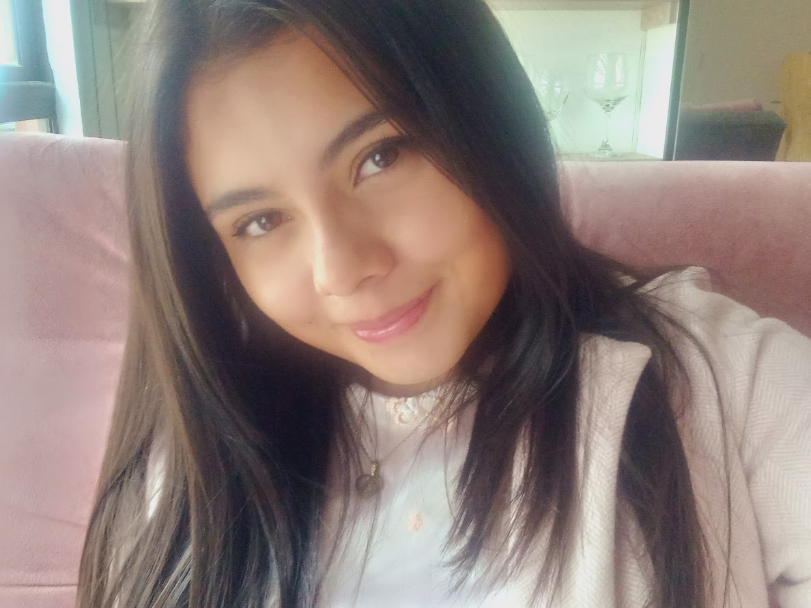
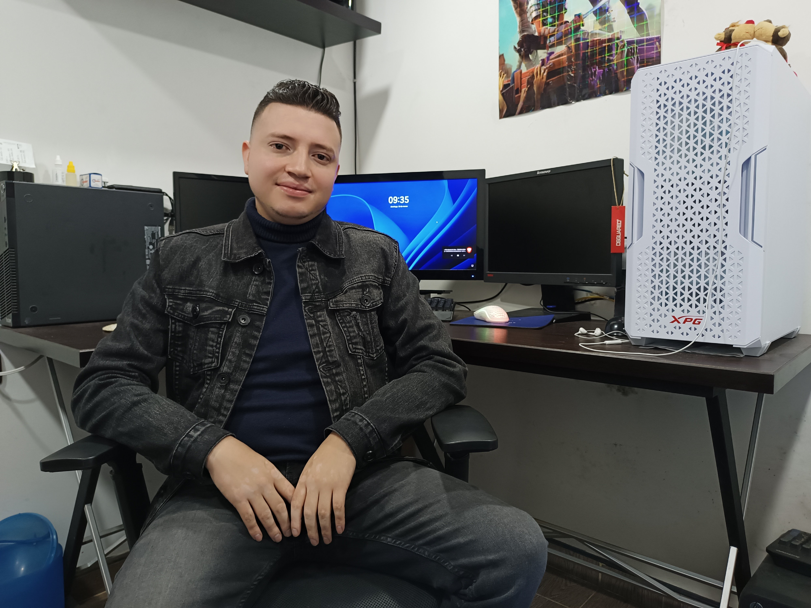

# Portafolio Web de Karen Tapias y Brayan López

## Introducción

¡Bienvenidos al portafolio web de **Karen Tapias** y **Brayan López**! Este proyecto fue realizado como parte del curso **Diseño y Desarrollo Web** del **2024-2** en **Fundación Universitaria Compensar**, bajo la orientación del profesor **Cristian Alejandro Amaya Fernández**. El objetivo de este portafolio es mostrar nuestras habilidades en desarrollo web, diseño y creación de proyectos interactivos.

**Integrantes del proyecto:**

- **Karen Tapias**: [GitHub](https://github.com/nerak610)
- **Brayan López**: [GitHub](https://github.com/BrayanGLopez)

## Proyecto

Este portafolio está desarrollado con tecnologías como **HTML**, **CSS**, **JavaScript** y **Bootstrap**. A través de este proyecto, hemos implementado varias funcionalidades que demuestran nuestras habilidades en diseño web, interacción de usuario y desarrollo front-end.

### Características

- **Diseño responsivo:** Este portafolio se adapta a diferentes tamaños de pantalla, desde dispositivos móviles hasta escritorios.
- **Interactividad:** Incluye funcionalidades como la búsqueda dinámica y el cambio de colores según la acción del usuario.
- **Diseño en 3D:** Elementos del portafolio, como botones e imágenes, tienen efectos interactivos en 3D.
  
## Imágenes de los integrantes

### Karen Tapias

Karen es una apasionada por el desarrollo web y la programación. Actualmente estudia **Ingeniería de Sistemas** y tiene un fuerte interés en el diseño y la usabilidad web.

### Brayan López

Brayan es un entusiasta del **Desarrollo Full Stack**. Se especializa en el diseño y creación de API's de alto rendimiento e interfaces atractivas, con un enfoque en la experiencia del usuario.

## Funcionalidades

| Funcionalidad          | Descripción                                                                                  |
|------------------------|----------------------------------------------------------------------------------------------|
| **Búsqueda dinámica**   | Permite buscar contenido específico dentro del portafolio y destaca los resultados en tiempo real. |
| **Cambio de colores**   | El fondo del sitio cambia a tonalidades de rosado al pasar el cursor sobre los elementos.      |
| **Animaciones 3D**      | Se agregaron animaciones en 3D para mejorar la interactividad y visualización del contenido.   |

## Tecnología Utilizada

- **HTML5**: Estructuración semántica de la página.
- **CSS3**: Estilos modernos con diseño responsivo.
- **SASS**: Preprocesador de **CSS** que añade robustes en los estilos.
- **JavaScript**: Funcionalidades interactivas y dinámicas.
- **Bootstrap**: Framework para diseño de interfaces responsivas.

## Agradecimientos

Agradecemos a **Cristian Alejandro Amaya Fernández**, nuestro profesor, por su valiosa orientación durante el desarrollo de este proyecto.

---

**© 2024 Karen Tapias y Brayan López - Todos los derechos reservados**

